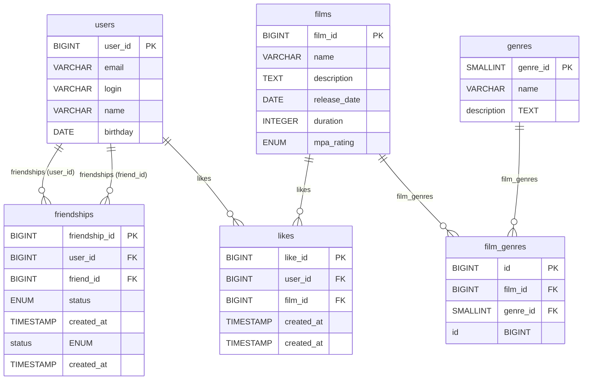

# java-filmorate

DB schema: 
(prettier verion available [here](https://drive.google.com/file/d/180JIfZNXEnq3Se4-3l66gs4mYytXpNV-/view?usp=sharing))

```mermaid
erDiagram
    users {
        BIGINT user_id PK
        VARCHAR email
        VARCHAR login
        VARCHAR name
        DATE birthday
    }

    films {
        BIGINT film_id PK
        VARCHAR name
        TEXT description
        DATE release_date
        INTEGER duration
        ENUM mpa_rating
    }

    genres {
        SMALLINT genre_id PK
        VARCHAR name
    }

    film_genres {
        BIGINT id PK
        BIGINT film_id FK
        SMALLINT genre_id FK
    }

    friendships {
        BIGINT friendship_id PK
        BIGINT user_id FK
        BIGINT friend_id FK
        ENUM status
        TIMESTAMP created_at
    }

    likes {
        BIGINT like_id PK
        BIGINT user_id FK
        BIGINT film_id FK
        TIMESTAMP created_at
    }

    users ||--o{ friendships : "friendships (user_id)"
    users ||--o{ friendships : "friendships (friend_id)"
    users ||--o{ likes : "likes"
    films ||--o{ likes : "likes"
    films ||--o{ film_genres : "film_genres"
    genres ||--o{ film_genres : "film_genres"

    friendships {
        status ENUM
        TIMESTAMP created_at
    }

    likes {
        TIMESTAMP created_at
    }

    film_genres {
        id BIGINT
    }

    genres {
        description TEXT
    }
```
