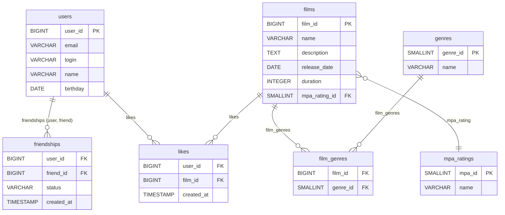

# java-filmorate

## DB schema:

(prettier version
available [here](https://drive.google.com/file/d/180JIfZNXEnq3Se4-3l66gs4mYytXpNV-/view?usp=sharing))


### Example queries
- Get all films (without genres):
```sql
SELECT
    *
FROM
    films;
```
- Get user by ID:
```sql
SELECT
    *
FROM
    users
WHERE
    user_id = ?; -- Parameter: User ID
```

- Select film by ID with genres and MPA rating (data comes back denormalized and is later processed
  by extractor):
```sql
SELECT
    f.film_id,
    f.name AS film_name,
    f.description,
    f.release_date,
    f.duration,
    m.mpa_id,
    m.name AS mpa_name,
    g.genre_id,
    g.name AS genre_name
FROM
    films f
LEFT JOIN
    mpa_ratings m ON f.mpa_rating_id = m.mpa_id
LEFT JOIN
    film_genres fg ON f.film_id = fg.film_id
LEFT JOIN
    genres g ON fg.genre_id = g.genre_id
WHERE
    f.film_id = ?; -- Parameter: Film ID
```

- Get top most liked films:
```sql
WITH film_likes AS (
    SELECT
        film_id,
        COUNT(film_id) AS likes_count
    FROM
        likes
    GROUP BY
        film_id
)
SELECT
    f.film_id,
    f.name AS film_name,
    f.description,
    f.release_date,
    f.duration,
    m.mpa_id,
    m.name AS mpa_name,
    g.genre_id,
    g.name AS genre_name,
    film_likes.likes_count
FROM
    films f
JOIN
    mpa_ratings m ON f.mpa_rating_id = m.mpa_id
LEFT JOIN
    film_genres fg ON f.film_id = fg.film_id
LEFT JOIN
    genres g ON fg.genre_id = g.genre_id
JOIN
    film_likes ON f.film_id = film_likes.film_id
ORDER BY
    film_likes.likes_count DESC,
    f.film_id,
    g.genre_id
LIMIT
    ?; -- Parameter: number of films to fetch
```
