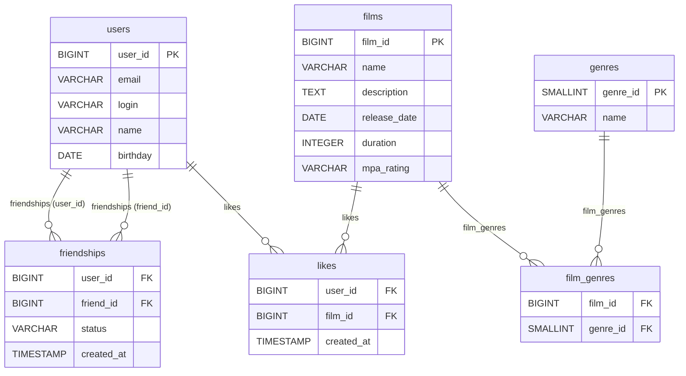

# java-filmorate

## DB schema:
(prettier verion available [here](https://drive.google.com/file/d/180JIfZNXEnq3Se4-3l66gs4mYytXpNV-/view?usp=sharing))


### Example queries
- Get all films (without genres):
```sql
SELECT
    *
FROM
    films;
```
- Get user by ID:
```sql
SELECT
    *
FROM
    users
WHERE
    user_id = ?; -- Parameter: User ID
```
- Get genres for film:
```sql
SELECT
    g.genre_id,
    g.name
FROM
    film_genres fg
JOIN
    genres g ON fg.genre_id = g.genre_id
WHERE
    fg.film_id = ?; -- Parameter: Film ID
```
- Get top 10 most liked films:
```sql
SELECT
    f.film_id,
    f.name,
    f.description,
    f.release_date,
    f.duration,
    f.mpa_rating,
    COUNT(l.like_id) AS like_count
FROM
    films f
LEFT JOIN
    likes l ON f.film_id = l.film_id
GROUP BY
    f.film_id
ORDER BY
    like_count DESC
LIMIT 10;
```
